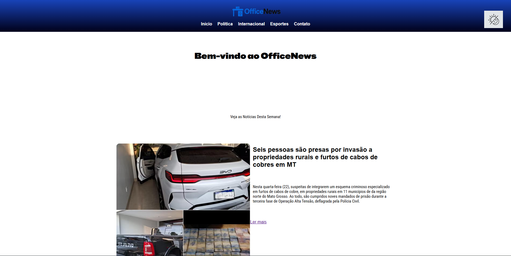

# OfficeNews
📰Esse projeto é sobre um site jornalistico, criado para a repassar informações virtualmente.

---

## 📸Captura de Tela

---

## 🔧Funcionalidades
* Botão de modo escuro
* Aba de comentarios
* Selecionamento de paginas sobre as noticias
* Mundança de cor para a pagina de esportes

---

## 🖥️Tecnologias ultilizadas
- HTML
- CSS
- JavaScript
- GIT e Github
- VS code

---

## ❓Como rodar?
* 1-Baixe o repositório (Clique no botão "Code" Download Zip)
* 2-Extraia a pasta
* 3-Abra o arquivo index.html no navegador

---

## Melhorias Futuras
* Melhorar o botão do modo escuro
* Responsividade em todas as paginas
* Atualização no visual da pagina

---

## Aprendizagem
- Aprendemos a usar o java para que fazer os comentarios do site
- A fazer o modo escuro
- E usar de melhor forma o Css

---

## Autores
* Desenvolvido por Ismael Menezes Kaio César Kaio Nogueira Gustavo Bryan
* Turma de Tecnologia em Informática para internet (Turno da turma) – Senac DF

